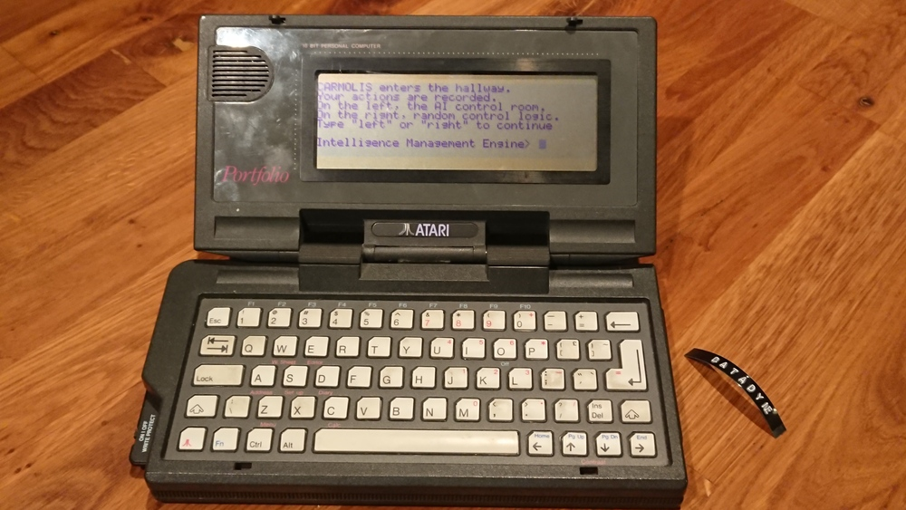

A dataDyne hacking sequence
===========================

Once upon a time there was a bachelor party in the form of `a game IRL`_ that sparked ideas from `the favorite game`_ of the hero of the day.
The AI in the RPG had to be hacked with a certain `high-tech console`_ running the Intelligence Management Engine, a futuristic user interface.
Before getting to that, the chosen one had a series of other challenges involving Maians, Skedars and other space stuff.

.. _a game IRL: https://en.wikipedia.org/wiki/Live_action_role-playing_game
.. _the favorite game: https://en.wikipedia.org/wiki/Perfect_Dark
.. _high-tech console: https://en.wikipedia.org/wiki/Atari_Portfolio

The high-tech console runs DIP DOS 2.11 on an Intel 80C88 CPU, interfacing with the user via a keyboard and a 40x8 character display.

Okay, this is a `text adventure`_ game.
All commands consist of single words except for the final battle.
Those single words are DOS batch files.
This was written in just one evening before the party.
There is no state.
That's right, you could jump directly to the winning scene from the start if you had an idea.
Our hero didn't know that and followed the game pretty much as planned.

Luckily the DOS prompt can be adjusted so that it looks like an input prompt for a game.
Unfortunately the "pause" command on this machine didn't accept a custom message so a few ideas had to go.
Anyway, we had great fun.

.. _text adventure: https://en.wikipedia.org/wiki/Interactive_fiction

To install, look up transfolio_ and plug in a parallel port adapter.
Make sure the extra memory card is plugged in and has a directory called ``party``.
Hit menu > setup > file transfer > server on the Portfolio and type ``make`` here.

.. _transfolio: http://www.pofowiki.de/doku.php?id=software:vorstellung:exchanges:transfolio
